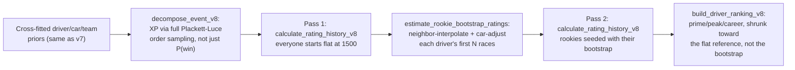

# v8: position-based, fault-aware, bootstrapped-rookie ranking

v7 (`historical_xw.ranking`) updates a driver's rating from win probability
alone: `K * (observed_win - XW)`. That can't distinguish "expected to win,
finished 2nd" from "expected to win, finished 15th" -- both just read as
"didn't win". v8 (`historical_xw.ranking_v8`) extends the same Shapley
machinery to a full-field position signal, adds DNF-fault awareness, and
replaces v7's flat 1500-for-everyone starting rating with a bootstrapped
estimate. It does not replace v7; both coexist, run independently, and can
be compared against each other on the same source data.



## XP: the position-based analogue of XW

`monte_carlo_full_ranking` (in `simulation.py`) samples a complete
Plackett-Luce finishing order -- repeatedly draw a winner among whoever's
left via the same softmax `coalition_probabilities` already uses for XW,
remove them, repeat -- instead of drawing only a single winner. Averaged
over many simulations, this gives each entry an **expected finishing
percentile** (`XP`, 1.0 = always wins, 0.0 = always last), decomposed into
`XdP`/`XcP`/`XtP` by the same exact grouped Shapley allocation used for XW.

`all_coalitions_expected_percentile` computes all eight coalitions as point
estimates (no capability resampling); `monte_carlo_full_ranking` on the
full coalition alone additionally resamples capabilities for a 95%
interval (`XP_simulated`, `XP_lower_95`, `XP_upper_95`) -- structurally
identical to how `all_coalitions`/`monte_carlo_wins` split that work for XW.

**A real, load-bearing mathematical identity**, checked directly against
real 2018-2024 Jolpica data in this project's own validation (every race's
`XP` values summed to exactly `n/2`, not approximately): because every
complete finishing order's percentiles sum to `n/2` (a combinatorial
identity of `1 - rank/(n-1)` summed over `rank = 0..n-1`), and expectation
is linear, the *average* over any number of simulations preserves that sum
exactly, not just asymptotically. `sum(XP) == n/2` is therefore a free,
exact sanity check on every single race, not a statistical one.

## The rating update, and the bug real data found in it

`calculate_rating_history_v8`'s update is:

```text
surprise = logit(observed_percentile) - logit(XP)
delta    = K * surprise
```

**This is a log-odds comparison, not a raw percentile difference, and
that choice is load-bearing, not stylistic.** The first implementation
compared raw percentiles (`observed_percentile - XP` directly, mirroring
v7's `observed_win - XW`) and, when validated against real 2018-2024 data,
rated Lewis Hamilton -- who won 29% of 148 races and podiumed in most of
the rest -- barely above the flat 1500 default, near the bottom of a real
40-driver field. The cause: a percentile is bounded in `[0, 1]`. A driver
whose XP is already 0.95+ (correctly reflecting a dominant car) has almost
no room left to register *positive* surprise even by winning every race,
while having unbounded room to register negative surprise on any race he
doesn't. Comparing in log-odds space instead (the same reason logistic/Elo
systems work in log-odds rather than raw probability space to begin with)
stretches distance-to-the-ceiling back out. `logit_clip_epsilon` (default
0.02) keeps a literal 0.0 or 1.0 percentile away from +-infinity.
`k_factor`'s default (8.0, down from v7's 32.0) was picked empirically
against the same real data to produce a comparable overall rating spread
to v7's, since log-odds differences have a much wider typical range than
raw probability differences. `raw_percentile_diff` is still reported
alongside `position_surprise` (the log-odds value actually used) for
anyone who wants the more intuitive number.

**A DNF's fault is classified**, not treated uniformly, via
`reliability.classify_status` (a curated Ergast/Jolpica status vocabulary,
kept in sync with the companion F1Predictor project's identical module): a
`MECHANICAL` DNF (car/team fault) is excluded from that race's update
entirely -- pre-rating carries over unchanged -- while an `ACCIDENT` DNF
counts against the driver at their actual (fell-out) finishing position,
same as any other result. An unrecognized status string fails safe to
`OTHER` (not excluded, not specially blamed) rather than guessing.

## The rookie bootstrap: not flat, not iterative, car-adjusted

v7 starts every driver at the same flat `initial_rating`. v8 estimates
each driver's actual starting rating from their first
`rookie_bootstrap_races` (default 5):

```text
local_rating    = mean(pre-race rating of whoever finished immediately
                        ahead and behind, in that same race, from a first
                        pass where everyone starts flat)
car_adjustment  = car_adjustment_weight * car_rating_scale
                  * (this car's z-scored strength - that race's
                     field-average car strength)
implied_rating  = local_rating - car_adjustment
```

averaged across however many of the driver's first races have at least one
neighbor to anchor against. Worked example: a rookie finishing between a
2000-rated driver (ahead) and an 1800-rated one (behind), in an
average-strength car, gets an implied rating of ~1900 -- verified directly
in `tests/test_ranking_v8.py`. A stronger-than-average car pulls that
number down (the car explains some of the good finish); a weaker one pulls
it up.

This is **explicitly a single bootstrap pass, not an iterative solve**:
`estimate_rookie_bootstrap_ratings` reads pre-race ratings from a first,
flat-start pass and feeds the result into exactly one second call to
`calculate_rating_history_v8`. Re-running the bootstrap against its own
output would be circular; nothing in this codebase does that
(`tests/test_ranking_v8.py::test_rookie_bootstrap_is_a_single_pass_not_iterative`
inspects the function's source to guard against a future refactor
reintroducing it).

`build_driver_ranking_v8`'s career-rating shrinkage anchors on the flat
`cfg.initial_rating`, not on each driver's own bootstrap value -- the same
reason v7 shrinks toward one shared constant for everyone. The bootstrap's
job is to seed the race-by-race walk (which correctly flows into
prime/peak/current rating); anchoring the *summary* stat's regularization
on a value that is itself an estimate would let a bootstrap error corrupt
the career number permanently, even at high experience.

### A precondition this project found by testing, not by inspection

**The bootstrap treats a driver's first appearance *in the supplied
dataset* as their rookie debut.** Run it on a truncated window -- this
project validated against a real 2018-2024 slice before the fix above --
and an already-established champion whose first *dataset* race happens to
land in that window gets bootstrapped as a rookie. Concretely: Hamilton
(real debut 2007) tested against 2018-2024 alone still came out ranked in
the bottom half of a real 40-driver field, even after the log-odds fix
resolved the ceiling-saturation bug, because his bootstrap had no way to
know he already had 11 real seasons of dominant prior form. Verstappen
(real debut 2015, but already an established multi-season race-winner by
2018) did *not* show this problem in the same test, most likely because
his early-2018 finishing positions already implied a strong rating via the
neighbor-interpolation step even without any adjustment for pre-2018
history -- Hamilton's case is the one where the missing context mattered.

This is not a bug to fix in the code: it is a real property of bootstrapping
from a window that doesn't span actual careers. **Run this against a
dataset that spans real driver debuts** (the full historical record from
the sport's first season) for the bootstrap to mean what it's supposed to
mean; use `rookie_bootstrap_races=0` (flat `initial_rating` for everyone,
identical to v7's approach) if analyzing a deliberately truncated window
where a wrong bootstrap would be worse than no bootstrap at all.

## Real-data validation performed for this version

Against actual Jolpica data (`analyze_season_v8` / `run-history-v8`,
2018-2024, 149 races, 40 real drivers):

- `sum(XP)` per race matched `n/2` exactly (to floating-point tolerance)
  for every one of 149 races -- confirms the Plackett-Luce sampling and
  Shapley decomposition are mathematically consistent, not just unit-tested
  in isolation.
- Verstappen (2021-2024 dominant era) ranked #1 in both v7 and v8, on the
  same underlying data -- the position-based signal and the fault-aware
  DNF handling don't disagree with the win-based baseline on the case
  that's easiest to get right.
- The Hamilton case above was found, diagnosed, and fixed (the log-odds
  change) through this same real-data pass, not assumed away -- and the
  residual truncated-dataset limitation was traced to its actual
  mechanism (the bootstrap precondition) rather than left as an
  unexplained anomaly.

## Known boundaries

- `car_rating_scale` (40.0 default) and `k_factor` (8.0 default) were both
  calibrated empirically against one real 2018-2024 slice, not derived
  from first principles or validated against the full historical dataset.
  Re-validate both once a full-history run is available.
- The rookie-bootstrap car adjustment uses `XcW_score` (the same z-scored
  car-strength prior fed into the simulation) as a linear correction; it
  is not itself validated against held-out data the way the underlying
  cross-fitted priors are.
- `_context()` in `real_pipeline.py` (shared with v7, untouched by this
  work) still hardcodes a single regulation era and neutral weather for
  every race regardless of season -- a pre-existing simplification, not
  something v8 changes or fixes.
