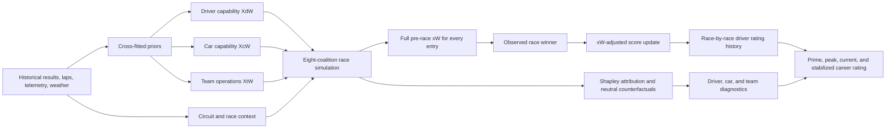

# F1 driver ranking architecture

This project joins two lines of work:

1. The legacy `E:\F1` research: multi-opponent Elo, constructor pace and reliability,
   overperformance versus car, teammate dominance, prime form, era normalization, and
   experience stabilization.
2. Historical XW: a cross-fitted, circuit-aware probability engine that separates the
   driver (`XdW`), technical car (`XcW`), and operations team (`XtW`) with exact grouped
   Shapley values.

## First combined model



For driver `i` in race `r`:

```text
surprise(i,r) = observed_win(i,r) - xW(i,r)
delta(i,r)    = K * surprise(i,r)
rating_after  = rating_before + delta(i,r)
```

This replaces the legacy linear car bonus with the richer xW expectation. A driver who
wins with `xW = 0.80` gains `0.20K`; a driver who wins with `xW = 0.10` gains `0.90K`.
A heavily favored driver who loses is penalized more than an outsider. Since xW and the
winner indicator both sum to one across a race, the updates sum to zero.

The career view retains the legacy prime/stability idea:

```text
career_raw = 0.75 * mean(best 60 post-race ratings)
           + 0.25 * peak post-race rating

experience = races / (races + 40)
career_rating = 1500 + experience * (career_raw - 1500)
```

All constants are explicit in `RankingConfig`; none are learned from the target race.
The published `score_0_100` is only a presentation scale within the selected population.

## Legacy research mapped into the maintained package

| Legacy source | Useful idea | Combined destination |
| --- | --- | --- |
| `CarConstructor.py` | Constructor pace plus mechanical reliability | `XcW` and `XtW` capability priors |
| `ELO.py`, `elo2.py`, `ELo3.py` | Dynamic rating, multi-opponent expectation, prime, stabilization | `historical_xw.ranking` |
| `ELo3.py` | Mechanical failures excluded from driver blame | XcW/XtW outcome attribution and data-quality rules |
| `ELo3.py` | Overperformance versus car | xW win surprise and neutral-driver counterfactual |
| `ELo3.py` | Teammate dominance | planned secondary finish-performance signal |
| `IAf1.py` | PCA exploration of composite metrics | optional sensitivity analysis, not the canonical score |
| `Grafico.py` | Driver rating history visualization | planned report/dashboard view |

The large CSVs under `E:\F1` are generated research artifacts. They are not copied into
Git; the maintained pipeline should reproduce canonical Parquet/CSV outputs from source
records and record the configuration used.

## Guardrails and next modeling stages

- Only information available before the target race may contribute to its xW.
- Full-race `XW`, not a same-race result feature, is the expectation in the update.
- A win-based score alone cannot measure excellent P2-P20 performances. The next stage
  should add a separately validated finish/gap and teammate signal from the legacy model.
- Mechanical, driver-fault, and operational failures need source-backed classification;
  ambiguous retirements should carry uncertainty instead of automatic blame.
- Era comparisons require calibration checks by era and leave-one-season-out backtests.
- Ranking weights should be exposed in sensitivity tables before claiming a definitive
  all-time "best" driver.
